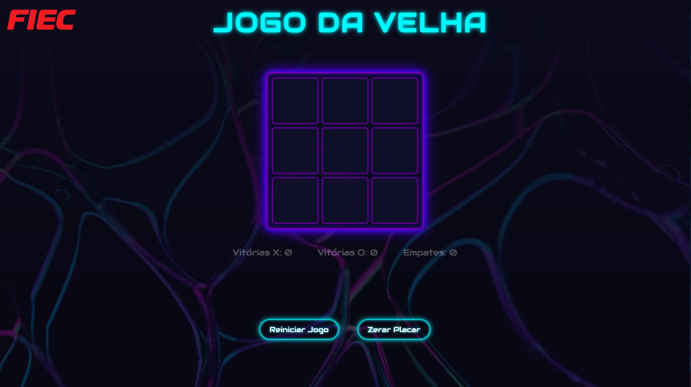

#  ❌ Jogo da Velha ⭕ - HTML, CSS e JavaScript

Um projeto simples e interativo de **jogo da velha** (tic-tac-toe) desenvolvido com HTML, CSS e JavaScript puro. Ideal para praticar lógica de programação, manipulação do DOM e estilos.

## 🔍 Demonstração

  

[Clique aqui para testar o jogo!](https://tcc-fiec.github.io/jogo-da-velha/)

## 🚀 Tecnologias Utilizadas

- **HTML5**: estrutura da página  
- **CSS3**: estilos visuais e responsividade  
- **JavaScript**: lógica do jogo, controle de jogadas e verificação de vitória/empate

## 🎮 Funcionalidades

- Dois jogadores (X e O) jogam alternadamente  
- Verificação automática de vitória ou empate  
- Reinício de partida e placar 
- Interface simples e responsiva

## 📁 Estrutura do Projeto

```
├── index.html        # Estrutura principal do jogo
├── style.css         # Estilos visuais do jogo
└── script.js         # Lógica e interatividade
```

## ✅ Como Usar

1. Clone o repositório:
   ```bash
   git clone https://github.com/seu-usuario/jogo-da-velha.git
   ```
2. Abra o arquivo `index.html` no navegador.  
3. Divirta-se jogando!

## 📄 Licença

Este projeto está licenciado sob a [MIT License](LICENSE).
Projeto desenvolvido para o evento Portas Abertas da FIEC.

